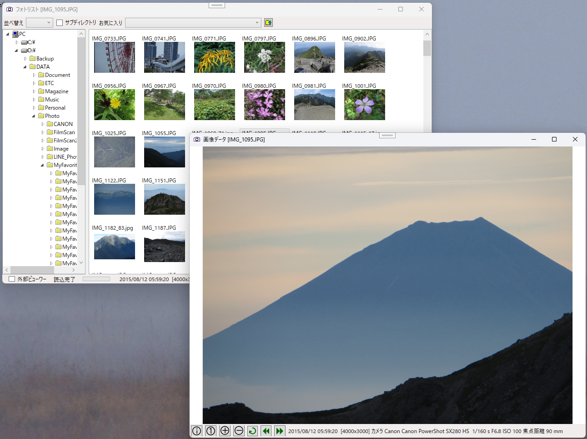
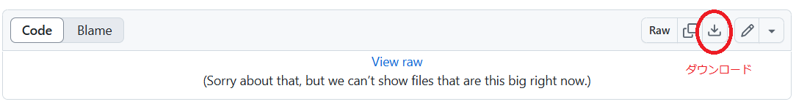
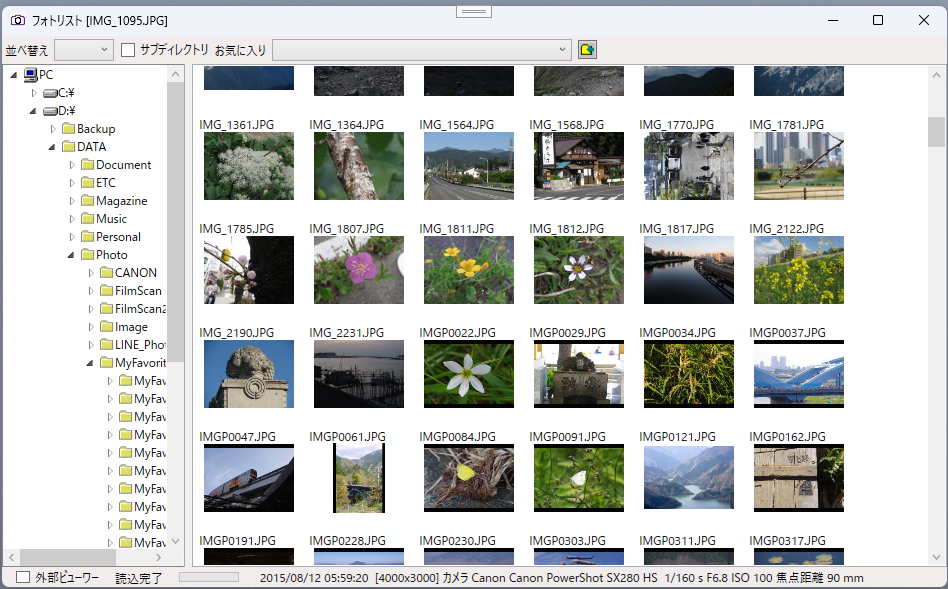
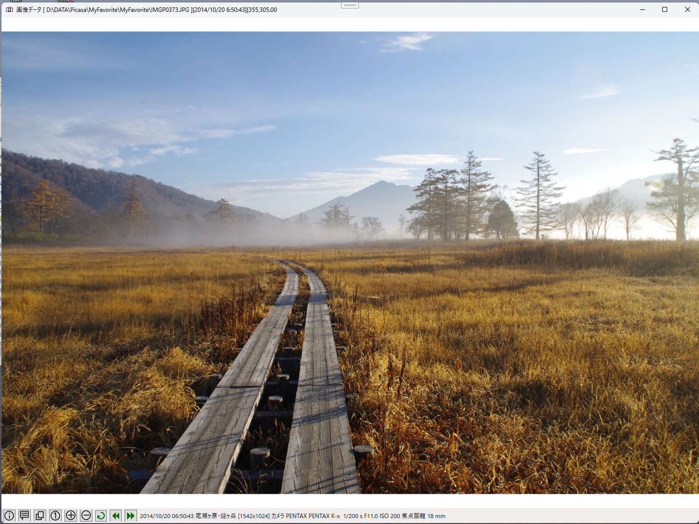

# PhotoViewer
## 写真ファイルの一覧表示

写真ファイル(jpg)の一覧を表示し、一覧から選択した写真ファイルの表示をする。  
他のソフトにない特徴として、写真ファイルにコメントの挿入、緯度経度の設定編集ができる。  
写真の緯度経度をコピーしてGoogle Mapなどに与えれば写真の撮影位置が特定できる。  
写真撮影時にGPSデータを記載したGPXファイルがあればGPXのデータから写真ファイルに撮影場所の緯度経度を設定できる。  

  

使い方などは[説明書](Document/PhotoViewerManual.pdf)を参照。  
実行方法は[PhotoViewer.zip](PhotoViewer.zip)をダウンロードし適当なフォルダーに展開して PhotoViewer.exe を実行する。  

#### メインウィンドウ(写真リスト)
  

### 機能
・ディレクトリ表示  
・写真のサムネイル表示  
・サムネイル表示のソート  
・サブディレクトリを含めての写真ファイルの検索  
・お気に入りにディレクトリ登録  
・写真属性情報の表示  
・コメントの追加  

　

#### イメージ表示
  

### 機能
・写真の属性情報を表示  
・写真データにコメントの追加・編集  
・画像全体を表示  
・画像の拡大 / 縮小表示  
・画像を90°回転する  
・画像を上下左右に移動  
・前後の写真に移動  

### 履歴
2026/09/30 ディレクトリ表示にVolumeLabelを追加  
2026/09/29 ディレクトリ表示でディレクトリの変更に対応  
2026/09/26 初回登録  

## ■実行環境
[PhotoViewer.zip](PhotoViewer.zip)をダウンロードします。
ファイルエクスプローラで適当なフォルダに展開し、フォルダ内の PhotoViewer.exe をダブルクリックして実行します。  
動作環境によって「.NET 8.0 Runtime」が必要になる場合もあります。  
https://dotnet.microsoft.com/ja-jp/download

### ■開発環境  
開発ソフト : Microsoft Visual Studio 2022  
開発言語　 : C# 10.0 Windows アプリケーション  
フレームワーク  :  .NET 8.0  
自作ライブラリ  : CoreLib (YLib,ImageViewDialog,FileCopyDialog,FileDeleteDialog,InputBox,ExifInfo,GpxReader)  